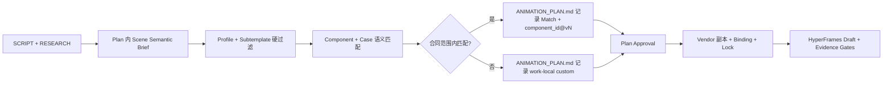
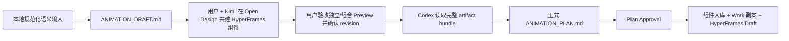

# HyperFrames AI vNext PRD Master

状态：已确认，阶段 A Plan 已批准，生产复用闭环待实现

产品范围：Component-Driven Motion

风险：T3 Parent PRD

日期：2026-08-24

## 产品定位

Component-Driven Motion 是现有 `hyperframes_video` 工作流的渐进升级：在保留 Script、Research、Animation Plan、Draft 和 Final 生命周期的前提下，把用户确认过的语义组件及其 GSAP Motion Recipe 沉淀为可复用资产，并由现有 `hyperframes-codex-workflow` 根据 `Profile + subtemplate` 提出使用方案。

它不是新的渲染器、Template、Profile 继承系统、自动剪片黑箱，也不把组件选择从用户手中移走。

## 用户与核心问题

主要用户是使用本 Harness 持续制作中文口播动效视频的创作者，以及执行这些 Work 的 Agent。

当前问题：

- Profile 与 Subtemplate 已能约束视觉身份和展示架构，但具体组件与 GSAP 编排仍主要在每个 Work 中临场重写。
- 已完成 Work 中有效的语义机制没有稳定合同，难以被后续 Work 安全调用。
- 组件发布包、真实使用案例与作品绑定尚未分离，新增案例可能破坏不可变版本。
- 组件选择缺少结构化语义匹配记录，后续容易退化为按名称或人工记忆复用。
- 公共源与 Work 副本没有统一的规范化 hash、锁文件和冻结证据，无法排除“复制后改写”的伪复用。
- 预设一批未经用户确认的组件，会把 PRD 假设当成真实设计。
- 只完成一次组件共建，只能证明交接链路，不能证明跨 Work 复用确实降低成本。
- 把索引、Planner、评分器和组件浏览器一起引入，会在首批资产出现前制造重复维护。

## 产品目标

1. 从真实场景中沉淀用户确认的组件，而不是预先发明组件清单。
2. 让组件拥有明确 Slots、Hero States、有限 GSAP 因果链和独立 Preview。
3. 让 `Profile + subtemplate`、组件、Motion Recipe、Animation Plan 和 Work 副本各自保持单一职责。
4. 首个 Work 证明组件设计、确认、入库与 Draft 落地，第二个真实 Work 证明相同版本可直接复用。
5. 正常工作流缺少组件时先完成 Work-local 实现并记录缺口，由用户后续统一安排新增设计或修改原设计。
6. 让组件发布包、边界 Fixture、真实 Case、Work Binding 和组合证据各自保持独立真源。
7. 让 Scene 语义与组件适用边界使用同一组字段，留下可审计的选择、拒绝和失败关闭记录。
8. 允许后续独立任务追加真实 Case，而不修改既有 `component_id@vN`。

## 非目标

- 不实现 `kami_editorial` 或 `monochrome_atelier` 组件包。
- 不实现 Profile 继承、子 Profile 或任意组合矩阵。
- 不把组件选择接入 `talking_head` 或 `podcast_quote_image`。
- 不预建六个组件或规定首个 Work 必须凑够三个组件。
- MVP 不新增 Component Planner Skill、`registry.json`、评分引擎、在线 Registry 服务或组件浏览器。
- MVP 不新增向量数据库、关键词硬路由、第二份 Scene 语义真源或组件运行时动态依赖。
- 在两个公共组件没有真实重复证据前，不发布公共 Element；在两个真实 Work 没有重复组合证据前，不发布通用 Composition Recipe。
- 不创建新的渲染运行时、全局 GSAP DSL 或跨 Scene 通用转场库。
- 不自动生成图片、下载媒体、烧录底部字幕或改变发布权限。
- 不迁移、改写或重新渲染历史 Work。

## 长期正常路径

正常路径中，用户仍通过整体批准 `ANIMATION_PLAN.md` 确认拟引用的公共组件及其 Motion Recipe。缺少组件时，Agent 在 Plan 中记录 `new` 或 `revise:<component_id>` 缺口，批准后先为当前 Work 实现；它不会自动进入公共库，也不能跨 Work 依赖。

## 本次临时路径

仅以下 Work 使用一次性设计共建流程，不新增全局生命周期或模板：

- Work：`work-20260821-一个人做号太累-先装这10个skill`
- Variant：`main`
- Template：`pure_hyperframes`
- Profile：`optical_fluidity`
- 目标画幅：`4:3`

`ANIMATION_DRAFT.md` 只描述本地预规范化的语义目标、真实长度样例、素材条件和事实边界，不预设组件拆分、Hero State、Motion Recipe 或 Slot API，也不构成审批门。正式 Plan 生成后保留它作为过程证据并标记 `superseded_by: ANIMATION_PLAN.md`；后续实现、QA 和 Final 只读取正式 Plan。

## 权责

| 层 | 拥有 | 不拥有 |
|---|---|---|
| Profile | 视觉身份、Tokens、材质、排版、Motion Grammar、硬限制 | Scene 实例、组件选择、具体 GSAP 时间线 |
| Subtemplate | 展示架构、信息占位、默认画幅映射 | 组件外观、Motion Recipe、作品文案 |
| Animation Draft | 本地预规范化的语义输入、长度样例、素材条件与事实边界 | 组件拆分、Hero States、Motion Recipe、Slot API、正式批准或生产源码 |
| Open Design artifact | 可独立 Preview/seek 的 HyperFrames 组件、内部 GSAP 与代表性组合 Preview | 现有组件检索与版本选择、最终文案/Slot 合同、整支视频编排 |
| Component | 可复用语义机制、Slots、Hero States、资产合同 | 整支作品结构、跨 Scene 创意决定 |
| Component Release | 一个不可变 `component_id@vN` 的自包含发布包 | 后续真实案例、作品绑定或跨 Scene 编排 |
| Fixture | 合同边界的合成输入与技术检查 | 真实适用性证明 |
| Case | 从真实 Work 脱敏出的语义适用与验收证据 | 扩大组件合同或修改发布包 |
| Work Binding | 当前 Scene 的 Slots、位置、尺寸、offset、timeScale、Hold 与本地媒体引用 | 修改 vendored 组件内部实现 |
| Composition Evidence | 真实组件组合、交接和 Hero 保持证据 | 自动成为通用转场资产 |
| Element Release | 多个公共组件在开发期共享的不可变内部机制 | Work 运行时动态依赖；MVP 暂不发布 |
| Motion Recipe | 组件内部有限、可 seek 的 GSAP 因果链 | Profile 外观、跨 Scene 转场 |
| hyperframes-codex-workflow | 按 `Profile + subtemplate` 检索、选择并调用组件/Motion Recipe，规范化 Slots 并记录缺口 | 新审批门、组件设计真源、渲染器 |
| Animation Plan | 当前 Variant 的组件引用、Slots、时间、偏离项与批准状态 | 公共组件实现真源 |
| Work Project | 已批准组件的精确副本、作品内容和媒体 | 反向修改公共组件库 |

## MVP 边界

- Profile：仅 `optical_fluidity`。
- Template：仅 `pure_hyperframes`。
- Subtemplate：既有 `hero_flow` 与 `module_stage`；当前验收 Work 使用符合列表型内容的 `module_stage`。
- 当前 Work 目标画幅：`4:3`。
- 组件兼容键：仅 `Profile + subtemplate`；画幅由 Work 与 Subtemplate 负责，不在组件索引中重复。
- 初始组件：由当前真实场景决定，不预设 ID 或数量；阶段 A 至少产生一个 `library-approved` 组件。
- 组件版本：不可变递增整数 `v1`、`v2`；已发布版本不得覆盖。
- 组件发现：现有 Skill 直接读取 `.studio/components/**/COMPONENT.md`，不维护重复 Registry。
- 案例发现：同时读取 `.studio/components/*/cases/**/CASE.md`；Case 只能证明合同内用法，不能扩大组件合同。
- 边界 Fixture：发布包内冻结一个默认 Fixture；后续 Fixture 以独立追加目录保存，不修改 `vN`。
- Work 安装：公共源码与作品数据物理分离为 vendored package、Scene Binding 和 `COMPONENT_LOCK.json`。
- 实现方式：复用 HyperFrames Block/Component、Sub-composition、Variables 和 GSAP，不新增依赖。

## 真源与冻结

- 用户确认前，Open Design artifact 是组件设计真源。
- 用户确认时冻结稳定 revision；若 Open Design 不提供稳定 revision，则对完整 artifact bundle 计算 SHA-256。
- 冻结面包含组件拆分与搭配、视觉结构、关键状态和可感知的内部动效；最终文案、精确 Profile 颜色、真实媒体、Slot API、生产 ID 和绝对时间不冻结。
- 正式 Plan 记录 Open Design project/file、revision 或 hash、组件确认结果以及 `work-local` / `library-approved` 分类。
- Plan 批准后，`library-approved` 版本进入 `.studio/components/`，并把精确、自包含的发布包复制进当前 Work 的 vendor 目录。
- 公共发布包包含合同、实现、Schema、默认 Fixture、hash 清单与基线；其 `vN` 目录发布后不可改变。
- 后续 Fixture 与 Case 位于发布包外的追加目录；新增它们不得改变既有 package hash。
- Work 的准确文案、时间和媒体只写入 Binding；vendored package 必须与公共源逐字节一致。
- `COMPONENT_LOCK.json` 记录组件引用、公共 package hash、Work 副本 hash、一个或多个 Binding 路径/hash 与安装文件，不承载作品文案。
- package hash 算法命名为 `component-package-sha256-v1`：排除 `HASHES.json` 本身，对所有其余文件按 POSIX 相对路径字典序排列，使用 `<file_sha256>  <relative_path>\n` 的 UTF-8 清单再次计算 SHA-256。
- Codex 优先直接采用完整 artifact 代码，只为 Slots、Profile 颜色映射、本地素材、seek-safe、离线渲染和 Work 隔离做最小规范化。
- 集成时只允许整体 `offset`、`timeScale`、位置、尺寸、Slots 适配和 Hero/Handoff 静止保持；任一调整破坏冻结效果时必须退回确认。
- Work 始终从本地副本渲染；公共库升级和 Open Design 后续修改不得改变既有 Draft。

## MVP 验收

### 阶段 A：设计沉淀

当前 `work-20260821-一个人做号太累-先装这10个skill/main` 必须：

1. 使用本次临时 `ANIMATION_DRAFT.md` 流程。
2. 由用户与 Kimi 在 Open Design 中共建可独立 Preview/seek 的 HyperFrames 组件及内部 GSAP，并交付一个简短的代表性组合 Preview；不完成整支视频设计。
3. 至少确认一个 `library-approved` 公共组件目标；正式 Plan 批准前不落库。
4. 正式 `ANIMATION_PLAN.md` 经用户整体批准后才进入生产 HTML。
5. 公共发布包、Work vendor 副本、Scene Binding 与 Lock 完成，公共源和 Work 副本 package hash 一致。
6. 产出可编辑 HyperFrames Draft，并通过 G0-G6 与 G8；阶段 A 只能标记 `production-installed`，不能标记 `reused`。

### 阶段 B：跨 Work 复用

后续另一条真实 Work 必须直接使用至少一个相同 `component_id@vN`：

- 只替换 Slots，并允许位置、尺寸、`offset`、`timeScale` 和 Hero/Handoff 静止保持；
- 不修改组件内部 DOM、样式结构或 GSAP 编排；
- 不交给 Kimi 重建；
- Scene Semantic Brief 在组件选择前形成，并记录匹配理由、反例检查、相关拒绝候选和 `custom` fallback；
- 完成 Plan 批准、vendor 复制、Binding/Lock、可编辑 Draft 和项目 QA；
- 通过 G7 后才标记 `reused`，再从真实 Work 脱敏追加第一个 Case；新增 Case 不得改变组件 package hash。

“真实 Work”必须来自用户实际内容需求，不能为证明复用而创建演示 Work；Scene 语义必须先于组件预选。当前 PRD 更新不新建阶段 B Work，由后续符合条件的真实输入触发。只有阶段 A 与阶段 B 都通过，才算证明组件库的复用价值。

## 缺口统计

正常 Work 中没有合适组件时，`ANIMATION_PLAN.md` 必须记录：

- `gap_type`: `new` 或 `revise:<component_id>`；
- narrative job 与需要的状态变化；
- 不复用现有组件的原因；
- 当前 Work 的 `custom:<slug>`。

不新增独立 Backlog。用户需要统一安排设计时，由 Skill 只扫描私有 Work 的这些结构化记录并汇总次数；旧的 Work-local 实现只能作为参考，不算公共复用。

## 语义发现与演进

每个候选 Scene 在正式 Plan 内记录同一组语义轴：叙事职责、信息结构、输入/变化/输出状态、证据需求、内容密度、时长预算、进入/退出合同和反例。组件 `COMPONENT.md` 与 Case `CASE.md` 使用同一组字段。

选择顺序固定为：硬约束过滤、语义职责匹配、状态变化匹配、反例检查、边界 Fixture/Case 验证、形成可审计 Match Record。Match Record 至少包含选中组件、匹配 Case（若有）、适配理由、相关拒绝候选与 `custom` fallback。语义字段留在 `ANIMATION_PLAN.md`，不新增并列的 `SCENE_SEMANTICS.md` 真源。

演进规则：

- 同一合同下的新真实用法新增 Case；合成边界输入新增 Fixture。
- 只调整 Slots、位置、尺寸、offset、timeScale 或 Hold 时修改 Work Binding。
- Slot/类型、安全区、时长范围、DOM、CSS、状态顺序或 GSAP beat 改变时发布新组件版本。
- 叙事职责改变时创建新组件；只服务当前作品或私有媒体时保持 Work-local。
- 同一内部机制在至少两个公共组件中稳定复用后，才创建 Element 候选；开发期共享，组件发布时 vendoring，不形成运行时依赖。

## 兼容与回滚

- 没有组件引用的历史 Animation Plan 按旧流程继续工作。
- 本次 `ANIMATION_DRAFT.md` 特例不新增 Work 状态，也不修改全局模板。
- 公共组件缺失或不匹配时失败关闭到 `custom`，不伪造匹配。
- 每个 Work 拥有安装后的源码副本；公共组件升级通过新版本发布，不覆盖旧版本或 Accepted Draft。
- Case、Fixture、Binding 和 Evidence 不得回写或覆盖既有发布包；hash 不一致时停止生产、Snapshot 或复用认定。
- 若跨 Work 复用未降低成本，可停止扩展组件库；现有 Profile、Subtemplate、Animation Plan 和 Work Project 仍可独立运行。

## PRD 索引

- [组件与动效模块 PRD](./hyperframes-component-motion.md)
- [决策台账](./_ledger/component-driven-motion-vnext.md)
- [rnskill 动效分层研究](./_research/rnskill-motion-layering.md)

## 审批边界

本 PRD 已完成复用方案修订确认。当前 Work 的 Open Design 组件与组合 Preview 已冻结，`ANIMATION_PLAN.md` revision 2 已批准；下一步是阶段 A 的 Harness 与生产复用闭环。本次确认授权修正 PRD 并优化本地 Harness，不代表授权 Git 提交、推送、发布、媒体下载、Cookie 使用、外部服务调用、完成整片 Draft 或新建阶段 B Work。

## Visual Payload Surface

视觉载荷采用统一的 `Visual Payload Surface` 模型，不把普通 `.card` 机械升级为媒体位。Surface 是已冻结的 DOM 锚点和语义职责；Binding 只提供载荷，不得改变卡片外壳的几何、遮罩、层级、3D、GSAP beat、Hero 或 Handoff。

MVP 只允许两种 Surface：

- `icon_node`：P001 的 Work-local 可替换本地 SVG/icon 节点。数量、位置和轨迹固定，禁止 URL、网络加载和运行时注入。
- `active_media_card`：B00 以及 P002-P012 中确实承载内容、输入、输出或证据的活动卡片内容层。结构卡、文字状态卡和装饰卡不建立 Surface。

B00 `chapter-intro@v1` 是唯一公共 Component；其 `evidence_primary` 是显式 `none`、`image` 或 `video` 的 `active_media_card`。`none` 保留既有程序化 fallback，`source_label` 仍是独立 Content Slot。图片和视频必须是 Work-relative 本地文件并记录存在性、probe 和 hash；视频播放由 HyperFrames 媒体属性接管，组件不得实现 `play/pause/currentTime/requestVideoFrameCallback` 时钟。P001-P012 仍是 Work-local，Binding 数据继续进入现有 `scene-slots.json` 或公共 `component-bindings`，不建立并列的媒体 Binding 文件。

Surface 合同、Binding、DOM 一一对应、媒体 probe/hash、`COMPONENT_LOCK.json` 记录和 Preview Snapshot 必须形成闭包；任何路径越界、URL/注入、缺失或篡改均失败关闭。公共版本不可覆盖，Slot、Surface 类型、内部 DOM/CSS、状态顺序或 Motion beat 改变时发布新的 `component_id@vN`。

本轮允许一个明确的 RC 例外：在首次 G6 与 Accepted Snapshot/Draft 完成之前，可以对 `chapter-intro@v1` 做一次原子 RC 重建，并同步公共包、Work vendor、Binding 与 Lock。首次 G6 + Accepted Snapshot/Draft 之后，`v1` 立即冻结；后续合同或实现变化只能发布新版本，不得覆盖既有包。
