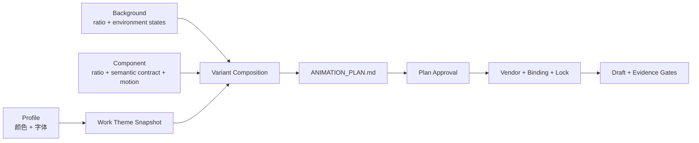

# HyperFrames AI vNext PRD Master

状态：v2.2 当前工作流修订；Theme / Background / Component 完整解耦仍为后续目标

产品范围：官方 Studio、逐 Scene 复用与独立资产接纳；保留三层解耦设计

风险：T3 Parent PRD

日期：2026-09-09

## 当前默认路径（v2.2）

Script / Research 就绪后，先筛选每个 Scene 的信息并匹配可用资产。已有适配组件直接复用；组合或参数可以解决时记录当前用法；只有真实设计缺口才做轻量样段，数量可以为零。全片颜色、字体可共享，局部样段的布局、信息结构和动效只覆盖 Plan 明确列出的 Scene。

官方 HyperFrames Studio 是制作与审阅的默认入口。Work 负责准确工程、版本、反馈和接受；冻结版本只通过隔离副本交给 Studio，不把 Studio 编辑自动算作原版本或用户批准。继续保留 v2.1 的内容筛选、去重、必要条件与真实来源。

合同兼容的 Component / 同合同效果包通过外部 AssetStore 独立导入、验证和精确接纳，再固定到 Work 的 vendor / Binding / Lock；不依赖 Harness 内置名单，也不等待全部旧家族或画幅齐备。普通新增资产不要求重发 Harness。Background / Profile 的完整独立安装与三层解耦仍需按实际合同实现，不能把当前 Component 链路冒充全部完成。

下文保留完整解耦目标和原批次 backlog，不作为当前 Work 或单个兼容资产的额外前置门。本文件是产品索引，不增加每次创作的必读材料。

## 产品定位

本次重构把 HyperFrames 的视觉系统拆成三个互不替代的版本化资产：

- `Profile` 只提供语义配色与字体；
- `Background` 只提供全画幅环境层及其低强度状态；
- `Component` 提供前景信息结构、画面效果与完整动效。

`16:9` 与 `4:3` 不再共享响应式组件实现。它们属于同一个 Component Family，但分别设计、版本化、Preview 和验收。现有 `subtemplate` 与 Profile Motion Grammar 从运行时合同中移除。

这不是新的渲染器、主题组合器或自动设计黑箱。`ANIMATION_PLAN.md` 仍负责当前 Work 的资产选择、Scene 编排和用户审批，Work 仍从冻结的本地副本渲染。

## 核心问题

- Profile 当前同时拥有配色、字体、材质、构图、画幅映射、Motion Grammar 与 easing，职责过宽。
- Component 又内嵌 Profile 颜色、字体、材质、布局和 easing，导致主题与表现重复拥有同一事实。
- `Profile + subtemplate` 作为组件兼容键，使语义组件无法跨 Profile 复用。
- 单个组件同时适配多个画幅，会把独立的构图和动效设计退化为缩放或响应式折中。
- 组件自带全画幅底色或环境效果，无法独立替换背景，也难以保持跨 Scene 的视觉连续性。
- 已冻结 Work 需要继续可复现，不能通过覆盖旧公共包完成架构迁移。

## 产品目标

1. 让 Profile 严格收窄为颜色和字体的不可变主题包。
2. 建立独立 Background Family；一个 Variant 固定一个画幅实现，Scene 只调用其预定义状态。
3. 让 Component 完整拥有布局、材质、几何、字号、层级、画面效果、GSAP 编排、easing 与 Hero/Handoff。
4. 移除 `subtemplate`、Profile Motion Verb 及 `Profile` 对组件检索的影响。
5. 让同一 Component Family 的 `4x3` 与 `16x9` 实现共享语义用途和 Slot 合同，但保持独立源码与版本。
6. 保留三套 Profile、二十个公共 Component Family 和一个 Background Family 的原整组重构 backlog，不阻塞单个兼容资产独立接纳。
7. 由 Open Design 保存设计原稿并完成集中 Gallery 验收；仓库只保存生产合同、实现、hash 与基线。
8. 保留旧 Work 的 vendored 快照与可复现性；合同兼容且已接纳的旧资产继续可用，完整新路径验证后再决定 legacy 退场，不覆盖旧包。

## 非目标

- 不把本轮二十个明确命名组件之外的组合预览、孤立 artifact 或图片批量公共化。
- 不增加新的 Template、Subtemplate、Profile 继承或子 Profile。
- 不让 Component 在运行时自动适配未设计的画幅。
- 不允许每个 Scene 任意更换 Background 实现。
- 不新增 Registry 服务、向量数据库、自动评分器、组件浏览器或新的渲染运行时。
- 不修改旧 Work 的 vendor、Binding、Lock、Accepted Draft 或 Final。
- 不把 Open Design 原稿、私有链接、作品文案或媒体复制进 Git。
- 不改变媒体下载、ImageGen、平台草稿或发布权限。

## 目标架构



## 权责

| 层 | 拥有 | 不拥有 |
|---|---|---|
| Profile | 语义颜色、字体栈、不可变版本 | 材质、圆角、阴影、字号、字距、构图、画幅、动效、easing |
| Background | 全画幅环境 DOM/CSS、纹理、光影、低强度环境动效、预定义 Scene 状态、画幅实现 | 标题、证据、卡片、叙事信息、前景 Hero/Handoff |
| Component Family | 跨画幅共享的语义用途与 Slot 合同 | 某一画幅的具体布局与动效实现 |
| Component Ratio Release | 指定画幅的 DOM/CSS、布局、材质、字号、画面效果、GSAP、easing、Hero/Handoff、Preview 与基线 | Profile 取值、全画幅 Background、跨 Scene 编排 |
| Animation Plan | `profile_ref`、`background_ref`、`ratio`、Scene Background State、Component Ref、Slots、时间与偏离项 | 公共资产实现真源 |
| Work Binding | 当前 Scene 的 Slots、位置、尺寸、offset、timeScale、Hold 与本地媒体引用 | 修改 vendored 组件内部实现 |
| Work Snapshot | Profile、Background、Component、Binding、Lock 与验收证据的精确副本 | 反向修改公共库或 Open Design |
| Open Design | 设计原稿、两个画幅的独立设计、集中 Gallery 与用户验收证据 | Work 运行时依赖、准确作品文案、最终 Binding |

## 最小主题合同

所有 Profile 必须提供同一组 token：

```text
color.canvas
color.surface
color.text_primary
color.text_secondary
color.accent_primary
color.accent_secondary
color.positive
color.warning
color.negative

font.display
font.body
font.mono
```

Component 与 Background 只消费这些语义 token，不声明特定 Profile。它们可以使用 `transparent`、`currentColor`，也可以从 token 派生透明度或混色；不得内藏 Profile 专用 fallback。品牌 Logo、图片与视频的固有颜色不受主题 token 限制。

字体 token 只定义字体栈。字号、字重、行高、字距和排版尺度由 Component 或 Background 的具体实现负责。

## 资产与引用

资产来源与 Harness 版本独立配置。当前 Component 包在外部 AssetStore 使用精确身份与版本目录；旧 `.studio/components/` 只读兼容，发现结果标明来源。同身份、同版本但内容不同必须拒绝覆盖或使用。完整解耦后，其他类型也按各自合同提供独立包，不把以下目标结构当作当前已全部支持的安装器：

```text
<独立资产开发目录>/...
<AssetStore>/packages/<精确资产身份>/<ratio（如适用）>/vN/
<WorkStore>/works/.../project/vendor/...
```

引用格式：

```yaml
profile_ref: optical_fluidity@v2
background_ref: functional-field/4x3@v1
ratio: 4x3
component_ref: rich-skill-explanation/4x3@v1
```

规则：

- `ratio` 只允许当前已设计并验收的 `4x3` 或 `16x9`。
- Profile、Background Ratio Release 与 Component Ratio Release 都使用不可变整数版本。
- 同一 Component Family 的两个画幅必须通过 Slot Schema 一致性检查。
- 一个画幅实现改变，只升级该画幅版本；不得静默改变另一画幅。
- 新 Work 的 Background 与所有 Component Ref 必须与 Variant `ratio` 一致。
- 新组件检索只使用 `ratio + semantic contract + slots/assets + duration + anti-use`，不使用 Profile 或 `subtemplate`。

## Background 运行规则

- 一个 Variant 只选择一个精确 `background_ref`。
- Background 可声明有限的命名状态，例如 `calm`、`focus-left`、`focus-center`。
- Scene 只能选择已声明状态，不能注入新背景 DOM/CSS，也不能更换 Background Release。
- Background 始终位于 Component 后方；Component 根节点必须透明，不得自带全画幅底色或环境层。
- Background 状态不得承载叙事文本、证据或替代 Component 的状态变化。
- 更换 Background Release、增加状态或改变可感知环境动效，必须提高 Plan Revision 并重新批准。

## 原整组重构 Backlog

本节保留 2026-09-03 确认的整组交付范围，不是 v2.2 新资产的白名单或当前 Work 的启动条件。

### Profile

- `optical_fluidity`
- `kami_editorial`
- `monochrome_atelier`

三者全部迁移到最小主题合同，并删除材质、构图、Motion Grammar、timing/easing、画幅映射和 `subtemplate` 规则。

### Component Family

- `rich-skill-explanation`
- `capability-convergence`
- `gap-first-selection`
- `rse-input-transform`
- `rse-retrieve-distill`
- `rse-knowledge-roundtrip`
- `rse-persist-reuse`
- `chapter-intro`
- `opening-weave-core`
- `topic-radar-core`
- `viral-breakdown-core`
- `script-draft-core`
- `storyboard-plan-core`
- `tone-rewrite-core`
- `cover-title-core`
- `graphic-card-core`
- `material-archive-core`
- `data-review-core`
- `weekly-report-core`
- `production-loop-core`

每个 Family 必须交付独立的 `4x3` 与 `16x9` Ratio Release。

### Background Family

- 首个 Background 以 Open Design 中现有 `rse-functional-background` 为 `4:3` 设计起点；最终生产 ID 在 Gallery 冻结时确定。
- 同时交付独立设计的 `16x9` Ratio Release。

Open Design `Hyperframes` 项目中的组合预览、缺失 HTML 的孤立 artifact 与 `image.png` 不计入本次公共库范围。

## Open Design 与冻结

- Open Design `Hyperframes` 项目继续作为设计原稿真源。
- Gallery 必须覆盖 `20 Component Families x 2 ratios + 1 Background Family x 2 ratios`，共 42 个可独立 Preview/seek 的实现。
- 用户可逐项退回；该历史批次只有 42 项全部通过才可宣称整组完成。单个兼容资产按其精确版本独立验证、接纳，不受未完成项阻塞。
- 每项冻结稳定 revision；无稳定 revision 时对完整 artifact bundle 计算 SHA-256。
- 独立资产开发目录记录 artifact ref、revision/hash、生产合同、实现、基线与 package hash；不复制 Open Design 私有原稿到 Harness 仓。
- 生产翻译只允许主题 token 接线、Slots、Work 隔离、seek-safe 与离线渲染所需调整；可感知差异必须退回 Gallery 重新确认。

## 迁移与兼容

- 新 Ratio Component 使用 `component-contract-v2`；其他类型按实际已实现的合同验证，不凭目录存在宣称可用。
- 现有公共包原样保留，legacy 身份由外部索引说明，不在 hash 覆盖文件内改状态；只读兼容发现明确标明来源与限制。
- 旧 Work 继续从原 vendored package、Binding 与 Lock 渲染。
- 当前 Work 使用已接纳、依赖闭合且满足真实画幅、内容与时间约束的精确资产；不得要求尚未完成的 Profile / Background 重构才能开始。
- 迁移不改写历史 Animation Plan、Accepted Draft、Final 或 Archive。
- 旧生产路径继续可用；新旧资产组合按实际合同兼容性检查，不以整组完成状态替代兼容性判断。`migration-ready` 不等于已接纳。

## 保持不变的能力

- Component Release 继续自包含语义合同、Slot Schema、默认 Fixture、实现、hash 清单与基线。
- 后续 Fixture 与脱敏 Case 继续采用追加式目录，不得修改既有 Release。
- Scene Semantic Brief、Component Match Record、anti-use 检查与 `custom:<slug>` 缺口记录继续有效。
- Work-local 媒体继续通过已声明 Visual Payload Surface 和 Binding 注入，并执行路径、存在性、probe、hash 与 Snapshot 闭包检查。
- Composition Evidence 继续只是组合验收证据，不自动成为公共转场或运行时依赖。
- 组件仍须 paused、seek-safe、可离线渲染；Background 也遵守相同时间确定性要求。

## 完整解耦目标验收

以下是原整组目标的完成标准，不代表本轮均已实现；v2.2 当前链路按索引中的专项 PRD 验收。

1. 三套 Profile 只包含最小主题合同，不再拥有画幅、材质、构图或动效字段。
2. 42 个 Open Design Gallery 项均完成独立设计、seek、关键状态与用户验收。
3. 每个 Component Family 的两个 Ratio Release 共享相同 Slot Schema。
4. 每个 Ratio Release 分别通过三套 Profile 的主题切换、对比度、字体回退与无硬编码检查。
5. Background 与 Component 能独立 Preview，组合后层级正确且 Component 全画幅根层透明。
6. 同一 Variant 的 Profile、Background、Component 与 ratio 引用闭合，错误组合在 Draft 前失败。
7. 新 Work 的 vendor、Binding、Lock 与离线渲染可复算；公共库断开后仍可 Preview/Render。
8. 旧 Work 的 vendored 快照和既有 hash 不改变，并继续可复现。

## PRD 索引

- [逐 Scene 复用、缺口 Plan 与官方 Studio PRD](./hyperframes-visual-plan-motion-reuse.md)：v2.2，逐场选信息与匹配资产、样段可为零、局部批准范围、Studio 默认入口及 v2.1 内容质量；不宣称真实返工已经下降。
- [组件与独立资产接纳 PRD](./hyperframes-component-motion.md)：v2.2，外部来源发现、候选验证、精确接纳与固定依赖；三层解耦和 42 项 Gallery 保留为原批次 backlog，不阻塞单资产。
- [Windows 创作工作台与 WSL 交接](./hyperframes-windows-workbench-wsl-handoff.md)：v2.2，锁定官方 Studio、独立资产配置与 Windows 接纳；固定会话、不可变候选、私有请求及隔离回测不变。
- [决策台账](./_ledger/component-driven-motion-vnext.md)
- [rnskill 动效分层研究](./_research/rnskill-motion-layering.md)

## 审批边界

本 PRD 记录产品边界与后续解耦范围，不自行扩大正式 Work、Open Design、Git 或外部发布授权。实施按当前用户请求与现行边界推进；单资产接纳、Plan 与 Draft 各自记录，不增加额外审批层，历史整组 Gallery 约定只约束该批次的完成声明。
